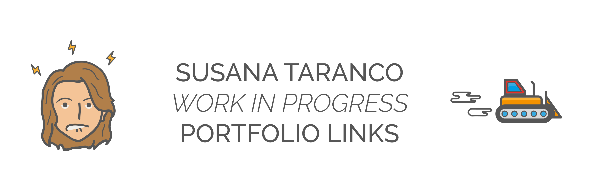

>🏭 Great and cool links for you to enjoy  **Susana Taranco WIP Portfolio**, created by Susana Taranco.

## Links list

- **Personal website** *Currently work in progress*

While designing my <a href="http://www.susana-taranco.me" target="_blank">personal website</a> (which is "work in progress"), I had complete freedom to choose the elements, color and typography so I'm my own boss and I do what I want. I want it to be an attractive single-page-like website, with a fullscreen video and that cool pink and orange gradient over it: they are my favourite colours and together they express just what I am: passionate, trendy and highly adaptative. A clear, sans-serif  and thin-lined font completes the circle because I like to call myself clear and direct, and that's how I like to be seen.

>   
 

- **Aprende HTML y CSS Avanzado** *Currently work in progress*

This is a very personal project I started to help my friends and acquaintances to improve their knowledge of HTML and CSS and whet it begun to grow I decided to make it public in order to shared it when it was finished. I use open source technologies provided by Github like Jekyll generator and GitHub pages. <a href="https://staranco.github.io/HTML-CSS-avanzado" target="_blank">Aprende HTML & CSS avanzado</a>

>   
 

- **Hyundai online catalogs UX definition and development** 

Starting from pdf <a href="http://www.hyundai.es/catalogo/ioniqhibrido.pdf" target="_blank">offline catalogues</a>, the final goal was to make them interactive. My job here was to design the UI according to final user's behaviour and the client's global look and feel. I also developed the catalog, so I was the front-end behind the scenes here, working with HTML5, CSS3, Jquery and regarding the principles of the mobile-first design. <a href="http://www.hyundai.es/catalogo/digital/ioniq" target="_blank">You can check here the online catalog example</a>

>   
 

- **Landing pages for Securitas Direct**

Same thing as above can be said about these <a href="http://www.conseguridad.org/landings/nuevas-landings/nuevas-camaras" target="_blank">landigns for Securitas Direct</a>, but in this case I dind't do the design, which is a cool and nice job of the people from Securitas Direct. I just made the magic happen.

>    
 

- **Solcom**

<a href="http://www.solcomsl.com" target="_blank">In this example</a> I made the design and also the front end and some back programming (the same technologies explained above plus a little Ajax and php)

>    
 

## Reach me
* https://twitter.com/susana_taranco
* https://github.com/staranco
 

## License
All this projects but my personal project were developed for solcomsl, former company I was working for.
